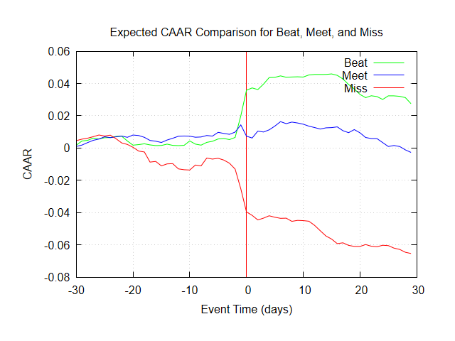
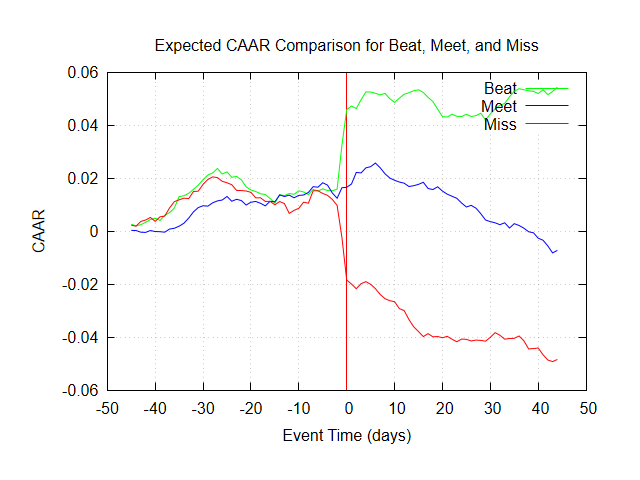

# Impact of Quarterly Earnings Announcements on Stock Price Movement - Results and Conclusion

## Overview
This event study examines how Q4 2025 earnings announcements affected the stock prices of Russell 3000 companies, using Cumulative Average Abnormal Returns (CAAR) analysis.

---

## Study Parameters

### Analysis Windows
The study was conducted using two different event window sizes to assess short-term and medium-term market reactions:

| Parameter | N=30 Window | N=45 Window |
|-----------|------------|------------|
| Window Size (days) | 30 | 45 |
| Valid Stocks Analyzed | 2,398 | 2,206 |
| Skipped Stocks | 70 | 262 |

---

## Results
### 4.1 CAAR Charts

#### Figure 1: N = 30 (Event Window: ±30 Trading Days)

#### Figure 2: N = 45 (Event Window: ±45 Trading Days)

---

### 4.2 Key Observations from CAAR Charts

#### Pre-Announcement Period (days −N to −1)

In both the N = 30 and N = 45 windows, all three groups exhibit **relatively flat and converging CAAR trajectories** before the announcement. The absence of a strong directional drift prior to day 0 suggests that, on average, the broader market does not fully anticipate the earnings outcome in advance.

However, in the N = 45 window, a modest upward drift is visible across all three groups in the −45 to −15 range, possibly reflecting a general market tailwind or sector-level momentum during the pre-announcement period.

#### Announcement Day (day 0)

The most striking feature across both windows is the **sharp divergence of all three groups at day 0**:

- **Beat** stocks experience a sudden, substantial **positive jump** in CAAR, reaching approximately **+3.5% (N=30)** and **+5% (N=45)** by day 0–1.
- **Miss** stocks experience a sharp **negative drop**, falling to roughly **−4% (N=30)** and **−2% (N=45)** immediately at and after announcement.
- **Meet** stocks show only a **modest positive reaction**, remaining near zero and drifting slightly upward (N=30) or slightly downward over time (N=45).

This sharp, asymmetric reaction at day 0 is the clearest evidence that **earnings announcements carry significant price-relevant information** that the market rapidly incorporates.

#### Post-Announcement Period (days +1 to +N)

- **Beat group:** After the initial jump, CAAR stabilizes and remains elevated, suggesting the market **sustains the positive repricing** rather than reversing it. In the N=30 window, Beat stabilizes around +4-5% in both N=30 and N=45 windows.
- **Miss group:** The decline continues post-announcement in both windows, with CAAR reaching approximately **−6.5% (N=30)** and **−5% (N=45)** by the end of the window. The persistent downward drift suggests **continued negative sentiment** or ongoing price discovery beyond the initial reaction.
- **Meet group:** Remains near zero throughout the post-announcement period in both windows, consistent with minimal information content for stocks whose results matched expectations.

---

## 5. Conclusions

### 5.1 Earnings Surprises Drive Significant Abnormal Returns
The results clearly demonstrate that **quarterly earnings announcements are significant market events**. Stocks that beat earnings expectations earn substantial positive abnormal returns concentrated at and immediately after the announcement, while stocks that miss expectations suffer material negative abnormal returns. Stocks that meet expectations exhibit only a negligible price response.

### 5.2 The Market Reacts Swiftly and Efficiently
The bulk of the price adjustment occurs on **day 0 and day +1**. Public earnings information is rapidly incorporated into prices, with no meaningful drift in the wrong direction after the announcement.

### 5.3 Asymmetry: Miss Stocks Suffer More Than Beat Stocks Gain
Comparing the magnitude of CAAR movements, the **downside reaction for Miss stocks** (approximately −6 to −7%) is larger in absolute terms than the **upside reaction for Beat stocks** (+4 to +5%). This asymmetry suggests markets penalize negative earnings surprises more severely than they reward positive ones.

### 5.4 Post-Announcement Drift for Miss Stocks
Unlike the Beat group, whose CAAR stabilizes after the initial jump, the **Miss group continues to drift downward** across the full post-announcement window in both N=30 and N=45 settings. This "Post-Earnings Announcement Drift" (PEAD) is a well-known market anomaly, suggesting that the market does not fully price in the negative surprise on day 0 and continues adjusting over subsequent weeks.

### 5.5 Sector-Neutral Design Strengthens the Results
By constructing Beat, Meet, and Miss groups with proportional representation from every sector, the study design ensures that the observed CAAR differences are attributable to **earnings surprises specifically**, rather than to any systematic sector tilts. The consistent results across both N=30 and N=45 windows further support the robustness of the findings.

### 5.6 Robustness Across Window Lengths
The patterns described above are **consistent across both window sizes (N=30 and N=45)**. The N=45 window provides additional evidence of limited pre-announcement drift, while confirming the magnitude and persistence of post-announcement price movements.

---

## 6. Summary Table

| Metric | Beat | Meet | Miss |
|---|---|---|---|
| CAAR at day 0 (N=30) | ~+0.65% | ~+0.2% | ~−2.5% |
| CAAR at end of window (N=30, day +30) | ~+2% | ~0.1% | ~−6.5% |
| CAAR at day 0 (N=45) | ~+3.5% | ~+1.5% | ~−1.5% |
| CAAR at end of window (N=45, day +45) | ~+4–5% | ~−1% | ~−5% |
| Post-announcement drift direction | Stable/slight fade | Flat | Continued decline |
| Interpretation | Strong positive market reaction | Not much change | Persistent negative repricing |
